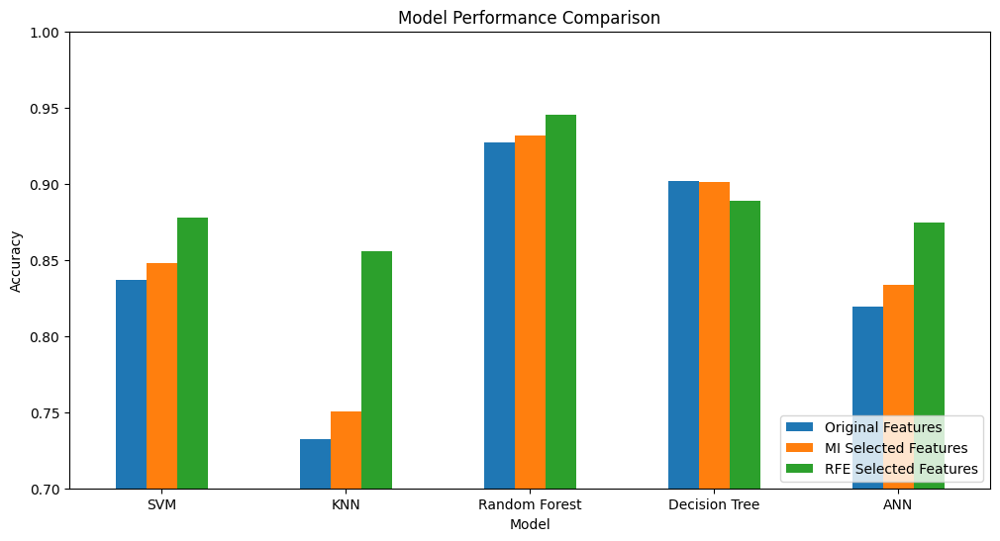
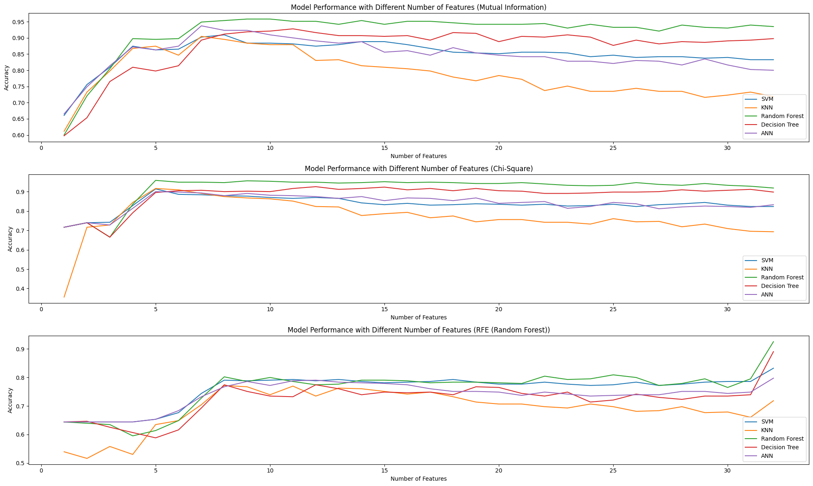
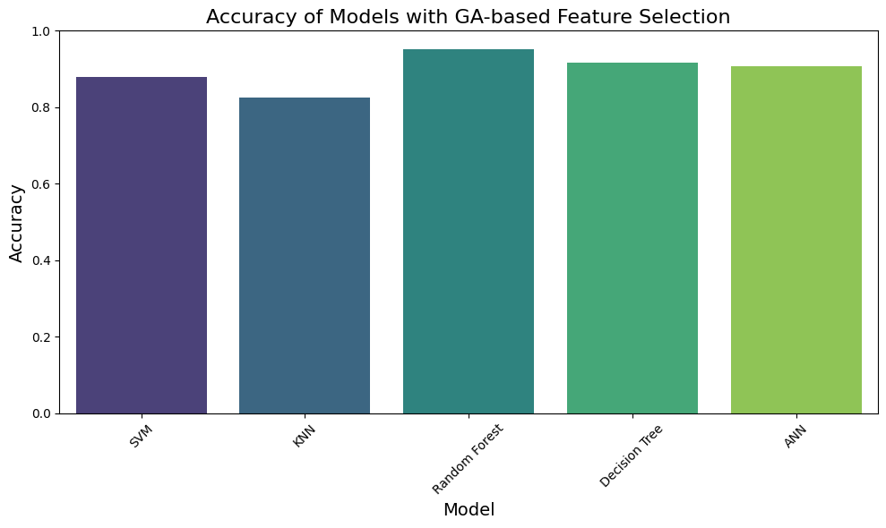

# Alzheimer's Disease Prediction Project

## 🧠 Introduction
This project aims to predict Alzheimer's disease using machine learning techniques. This project explore various feature selection methods and machine learning models to achieve the best possible prediction accuracy.

## 📊 Dataset
I use the Alzheimer's Disease Dataset from Kaggle:
[Alzheimer's Disease Dataset](https://www.kaggle.com/datasets/rabieelkharoua/alzheimers-disease-dataset)

The dataset includes various features such as age, gender, ethnicity, education level, BMI, lifestyle factors, and cognitive assessments.

## 🛠 Methodology
Our approach involves:

1. **Data Preprocessing**: 
   - Removing irrelevant columns (PatientID, DoctorInCharge)
   - Handling missing values
   - Encoding categorical variables
   - Scaling numerical features

2. **Feature Selection Methods**:
   - Mutual Information
   - Chi-Square
   - Recursive Feature Elimination (RFE) with Random Forest
   - Genetic Algorithm

3. **Machine Learning Models**:
   - Support Vector Machine (SVM)
   - K-Nearest Neighbors (KNN)
   - Random Forest (RF)
   - Decision Tree (DT)
   - Artificial Neural Network (ANN)

4. **Evaluation**: 
   I assess model performance using accuracy scores and visualize the results to compare different approaches.

## 📈 Results
The analysis reveals:

- Random Forest consistently performs well across different feature selection methods.
- The number of features significantly impacts model performance.
- Mutual Information and RFE tend to yield better results compared to Chi-Square for feature selection.

Best performing model:
- Random Forest with Mutual Information feature selection
- Accuracy: ~95% (with 5 features)

## 🖼️ Visualizations
I provide plots showing model performance with different numbers of features for each feature selection method.

## 🚀 Getting Started
To run this project:

1. Clone the repository
2. Install required packages: `pip install -r requirements.txt`
3. Download the dataset from Kaggle and place it in the project directory
4. Run the Jupyter notebook

## 🤝 Contributing

Contributions, issues, and feature requests are welcome! Feel free to check [issues page](https://github.com/KrisnaSantosa15/alzheimer-fs-ml-comparison/issues).

## 📄 License

This project is [MIT](LICENSE) licensed.

---

If you find this project interesting, don't forget to give it a star! ⭐

Best regards,  
Krisna Santosa